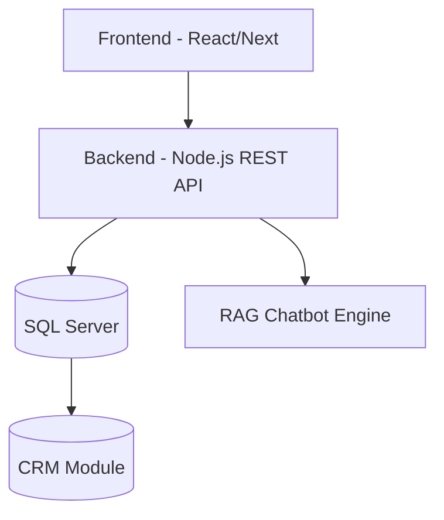

# 🚀 CSKH-system  
<!-- ALL-CONTRIBUTORS-BADGE:START - Do not remove or modify this section -->
[](#contributors-)
<!-- ALL-CONTRIBUTORS-BADGE:END -->
**Nền tảng Hỗ trợ Tư vấn & Chăm sóc Khách hàng cho Doanh nghiệp Bán hàng**  

<p align="center">
  
  
  
  
</p>

---

## 📖 Giới thiệu
🔥 **CSKH-system** là hệ thống **All-in-one** giúp doanh nghiệp quản lý **tư vấn – chăm sóc khách hàng**.  
👉 Tăng trải nghiệm, rút ngắn thời gian phản hồi, bùng nổ tỷ lệ chuyển đổi!  

---

## ✨ Tính năng nổi bật
- 💬 **Chat trực tiếp** với nhân viên CSKH  
- 🤖 **Chatbot AI (FAQ + RAG)**  
- 📊 **CRM thông minh**: quản lý, phân loại & tracking khách hàng  
- 📈 **Báo cáo & Thống kê realtime**  
- 🔔 **Thông báo tức thì** cho nhân viên  
- 🌐 **Đa kênh**: Zalo OA, Facebook, Email, Website  

---

## 🏗️ Kiến trúc hệ thống

## 🚀 Cài đặt nhanh
```
# Clone dự án
git clone https://github.com/van080105/CSKH-system.git
cd CSKH-system

# Cài dependencies
npm install

# Config biến môi trường
cp .env.example .env

# Chạy hệ thống
npm run dev
```

📊 Roadmap

✅ Chatbot cơ bản

🚧 Live chat cho nhân viên CSKH

🔜 CRM nâng cao

🔮 AI gợi ý kịch bản tư vấn

🌐 Tích hợp thêm kênh (Zalo OA, Email, SMS)

🏆 Leaderboard đóng góp

🔥 Đua TOP để hệ thống ngày càng xịn hơn!

<!-- GITCONTRIBUTOR_START -->

## Contributors

|[<br/><sub><b>ThienNguyen666</b></sub>](https://github.com/ThienNguyen666)<br/>|
| :---: |


This project follows the git-contributor [spec](https://github.com/xudafeng/git-contributor), auto updated at `Mon Sep 29 2025 20:17:00 GMT+0700`.

<!-- GITCONTRIBUTOR_END -->

👉 Bảng này tự động update commit/PR/issue hàng tuần.

👥 Contributors

Cảm ơn những anh em máu lửa đã cùng xây dựng dự án:

<!-- ALL-CONTRIBUTORS-LIST:START - Do not remove or modify this section -->
<!-- prettier-ignore-start -->
<!-- markdownlint-disable -->
<table>
  <tbody>
    <tr>
      <td align="center" valign="top" width="14.28%"><a href="https://github.com/ThienNguyen666"><br /><sub><b>Nguyễn Chí Thiện</b></sub></a><br /><a href="https://github.com/ThienNguyen666/test-readme/commits?author=ThienNguyen666" title="Code">💻</a></td>
    </tr>
  </tbody>
  <tfoot>
    <tr>
      <td align="center" size="13px" colspan="7">
        
          <a href="https://all-contributors.js.org/docs/en/bot/usage">Add your contributions</a>
        </img>
      </td>
    </tr>
  </tfoot>
</table>

<!-- markdownlint-restore -->
<!-- prettier-ignore-end -->

<!-- ALL-CONTRIBUTORS-LIST:END -->

✨ Tham gia ngay để tên bạn hiển thị trong bảng vàng vinh danh + leaderboard đua top!

🤝 Đóng góp

Mọi ý tưởng, tính năng mới hoặc báo lỗi đều được chào đón!
👉 Tạo Issue hoặc Pull Request ngay hôm nay để ghi danh vào Leaderboard.

📜 Giấy phép

MIT License. Xem chi tiết tại LICENSE
.

📬 Liên hệ

🌍 Website: updating...

📧 Email: updating...

💬 Hotline: updating...

## Contributors ✨

Thanks goes to these wonderful people ([emoji key](https://allcontributors.org/docs/en/emoji-key)):

<!-- ALL-CONTRIBUTORS-LIST:START - Do not remove or modify this section -->
<!-- prettier-ignore-start -->
<!-- markdownlint-disable -->
<!-- markdownlint-restore -->
<!-- prettier-ignore-end -->
<!-- ALL-CONTRIBUTORS-LIST:END -->

This project follows the [all-contributors](https://github.com/all-contributors/all-contributors) specification. Contributions of any kind welcome!